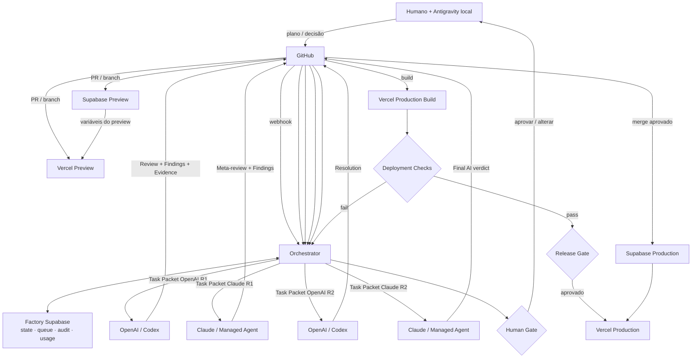

# Integração Entre Todos — Como as peças conversam

Este é o documento que amarra Supabase, GitHub, Vercel, OpenAI, Anthropic e Antigravity em **um único sistema**.

---

## 1. Mapa de responsabilidades

```
┌──────────────┬────────────────────────────────────────────────────┐
│ Antigravity  │ planejamento e aprovação humana (local)            │
│ + Humano     │ AUTORIDADE FINAL                                   │
├──────────────┼────────────────────────────────────────────────────┤
│ Control Plane│ observa, explica e COMANDA                         │
│ (Vercel)     │ nunca executa agente                               │
├──────────────┼────────────────────────────────────────────────────┤
│ Orchestrator │ decide o próximo passo. DETERMINÍSTICO             │
├──────────────┼────────────────────────────────────────────────────┤
│ Supabase     │ estado, filas, evidências, auditoria, custos       │
│ (Factory)    │ VERDADE DA OPERAÇÃO                                │
├──────────────┼────────────────────────────────────────────────────┤
│ GitHub       │ código, migrations, planos, inteligência, PRs      │
│              │ VERDADE DO SOFTWARE                                │
├──────────────┼────────────────────────────────────────────────────┤
│ OpenAI       │ trabalhadores probabilísticos                      │
│ Anthropic    │ não governam o workflow                            │
├──────────────┼────────────────────────────────────────────────────┤
│ Supabase     │ backend de cada aplicativo produzido               │
│ (App)        │                                                    │
├──────────────┼────────────────────────────────────────────────────┤
│ Vercel (App) │ preview e runtime de cada aplicativo produzido     │
└──────────────┴────────────────────────────────────────────────────┘
```

---

## 2. O diagrama integrado



---

## 3. Sequência completa de uma etapa

Esta é a sequência exata que o Orchestrator executa. Cada linha é um estado persistido.

```
 1. task criada e dependências satisfeitas         → READY
 2. Intelligence Resolver monta o Task Packet
 3. Agent Router escolhe runtime e perfil
 4. job enfileirado                                 → QUEUED
 5. worker adquire lease                            → LEASED
 6. worker cria worktree isolado + branch
 7. adapter.start(taskPacket)                       → RUNNING
 8. eventos normalizados chegam e são persistidos
 9. agente produz commit e artefatos
10. artefatos validados contra schema               → ARTIFACT_READY
11. GitHub App abre o Execution PR
12. webhook github.pr.opened chega
13. Supabase cria preview branch  ──┐
14. Vercel cria preview deployment ─┤
15. AMBOS prontos → preview_pair_ready  ★
16. CI roda: lint, types, unit, integration, rls, security
17. Review Engine abre o ciclo                      → REVIEWING
18.   passagem 1: OpenAI R1
19.   passagem 2: Claude R1 (meta-revisa a 1)
20.   passagem 3: OpenAI R2 (reconcilia)
21.   passagem 4: Claude R2 (conclui)
22. findings e divergências persistidos
23. gates determinísticos avaliados                 → AWAITING_CHECKS
24. R8 executa verificação de navegador no preview
25. R9 consolida evidências
26. human gate aberto                               → AWAITING_HUMAN
27. Handoff Bundle gerado
28. evento approval.requested → RNS Local Bridge
29. humano decide (Antigravity ou web)
30. approval gravada com actor_type='human'         → APPROVED
31. Release Service faz merge
32. webhook github.pr.merged                        → COMPLETED
33. próxima etapa fica READY
```

---

## 4. As três pontes críticas

### Ponte 1 — GitHub ↔ Supabase (branching)

```
branch git criada
      ↓
integração detecta
      ↓
Supabase cria branch correspondente
      ↓
migrations do diretório migrations/ aplicadas
      ↓
commits seguintes aplicam apenas as NOVAS migrations
      ↓
PR fechado → branch descartada
```

Regras:
- Preview **não** recebe dados de produção. Seeds sintéticos obrigatórios.
- Reaplicar migrations exige reset, que apaga dados. Nunca automático.
- O check de migração é **required status check**. Migration inválida não chega a `main`. ★

### Ponte 2 — Supabase ↔ Vercel (variáveis de preview)

```
PR aberto
      ↓
Supabase preview branch criada
      ↓
integração sincroniza as variáveis para o preview Vercel
      ↓
★ CONDIÇÃO DE CORRIDA entre injeção de variáveis e build
      ↓
a integração força redeploy do deployment mais recente do PR
      ↓
só então o preview é confiável
```

Consequência: **`preview_pair_ready` exige os dois eventos.** Declarar pronto com um só é defeito que produz E2E falso-negativo intermitente.

### Ponte 3 — GitHub ↔ Vercel (deployment checks)

```
merge em main
      ↓
Vercel cria production build
      ↓
Vercel LÊ os status de check do GitHub
      ↓
enquanto houver check pendente ou vermelho,
o build NÃO é apontado para o domínio de produção
      ↓
todos verdes → release gate humano → rolling release
```

Armadilha: nomes de job duplicados colidem. Usar nome único por check, incluindo o ambiente.

---

## 5. Matriz de eventos — quem emite, quem consome

| Evento | Emissor | Consumidor | Efeito |
|---|---|---|---|
| `github.pr.opened` | GitHub | Orchestrator | cria `pull_requests`, espera preview pair |
| `supabase.branch.ready` | Supabase | Orchestrator | marca `supabase_ready = true` |
| `vercel.deployment.ready` | Vercel | Orchestrator | marca `vercel_ready = true` |
| `preview_pair_ready` | Orchestrator | Orchestrator | libera R8/E2E |
| `github.check.completed` | GitHub | Orchestrator | atualiza `ci_checks` |
| `run.completed` | Adapter | Orchestrator | valida artefatos, avança ciclo |
| `review.cycle_closed` | Review Engine | Orchestrator | abre human gate |
| `approval.granted` | Control Plane / Bridge | Orchestrator | libera merge |
| `github.pr.merged` | GitHub | Orchestrator | conclui a etapa |
| `vercel.promotion.requested` | Release Service | Vercel | promove após gate |
| `budget.exceeded` | Budget Service | Orchestrator | interrompe run |

---

## 6. Matriz de credenciais — quem tem o quê

| Componente | GitHub | Supabase Factory | Supabase App | Vercel | OpenAI | Anthropic | Produção |
|---|---|---|---|---|---|---|---|
| Control Plane (browser) | — | publishable + RLS | — | — | — | — | **DENY** |
| Control Plane (server) | via App | secret | — | leitura | — | — | **DENY** |
| Orchestrator | App control | secret | management | escrita | via WIF | via WIF | **DENY** |
| Worker | App worker (branch) | — | preview only | leitura preview | token curto | token curto | **DENY** |
| **Agente** | **nenhuma** | **nenhuma** | **nenhuma** | **nenhuma** | — | — | **DENY** |
| Release Service | App release | leitura | migrations prod | promoção | — | — | **permitido por política** |
| Antigravity local | leitura via MCP | — | leitura preview | leitura preview | — | — | **DENY** |

★ A linha do agente é a mais importante da tabela. Um agente **não tem credencial de nada**. Tudo passa pela RNS Tool API com policy check.

---

## 7. Fluxo de dados de um número na tela

Exemplo: o KPI "Taxa de sucesso 96%" no Monitoramento.

```
agente executa
      ↓
adapter emite run.completed com status
      ↓
Orchestrator persiste em agents.runs (state = succeeded|failed)
      ↓
view materializada monitoring.daily_run_stats agrega
      ↓
GET /api/monitoring/overview lê a view
      ↓
Server Component renderiza o KpiCard
      ↓
Realtime atualiza quando chega novo run.completed
```

Cada número da interface tem uma cadeia assim, documentada na seção 6 do documento da página.

---

## 8. O que quebra se alguém errar

| Erro | Consequência |
|---|---|
| Declarar preview pronto só com o evento do Vercel | E2E roda contra banco errado. Falso negativo intermitente e caro de depurar |
| Dar `sb_secret_` a um agente | RLS contornada. Vazamento total possível |
| Permitir agente aprovar | A fábrica perde a garantia central. Tudo depois disso é teatro |
| Usar PAT em vez de GitHub App | Credencial permanente com escopo amplo; raio de alcance enorme |
| Nomes de check duplicados no Vercel | Promoção intermitente e inexplicável |
| Skills sem CODEOWNERS | Qualquer commit muda o comportamento de um agente com shell |
| Rodar agente em Edge Function | Timeout, execução perdida, sem rastro |
| `status = running` sem lease | Worker morto trava a tarefa para sempre |
| Sem idempotência | Webhook duplicado cria dois PRs, duas cobranças, dois runs |
| Migrations sem required check | Migration quebrada chega a produção |

---

## 9. Ordem de conexão na Fase 1

```
1. Factory Supabase        criar projeto, schemas, tabelas, RLS
2. GitHub                  organização, repositórios, GitHub Apps, rulesets
3. Vercel (Control Plane)  ligar ao rns-factory, variáveis, proteção de preview
4. Webhooks                GitHub → Control Plane, com verificação de assinatura
5. Filas                   pgmq no Factory Supabase
6. Worker                  processo externo consumindo a fila
7. MockAdapter             prova o circuito sem custo nem rede
8. Integração GitHub↔Supabase   branching automático, required check
9. Golden template         repositório base dos apps produzidos
```

Só depois disso a Fase 2 pluga OpenAI, Anthropic e Antigravity.

---

## 10. Teste de integração que prova tudo

Antes de declarar a Fase 1 concluída, este teste precisa passar **de ponta a ponta**, automatizado:

```
□ criar organização e usuário
□ criar projeto pela API
□ gerar plano (heurística)
□ abrir ciclo de revisão com MockAdapter nas 4 passagens
□ ciclo conclui com READY_FOR_HUMAN_APPROVAL
□ tentar aprovar com actor_type='agent' → REJEITADO pelo banco  ★
□ aprovar com actor_type='human' → aceito, com subject_sha
□ criar tarefa e despachar
□ MockAdapter produz artefato válido contra schema
□ GitHub App abre PR real
□ Supabase cria preview branch
□ Vercel cria preview deployment
□ preview_pair_ready só dispara com AMBOS  ★
□ CI roda e reporta checks
□ reenviar o MESMO webhook 5 vezes → nenhum efeito duplicado  ★
□ matar o worker no meio → lease expira → outro retoma → sem duplicação  ★
□ merge bloqueado com check vermelho
□ merge liberado com tudo verde
□ audit_events contém a trilha completa e correlacionável
```

Os quatro itens marcados são os que distinguem um protótipo de uma fábrica.
