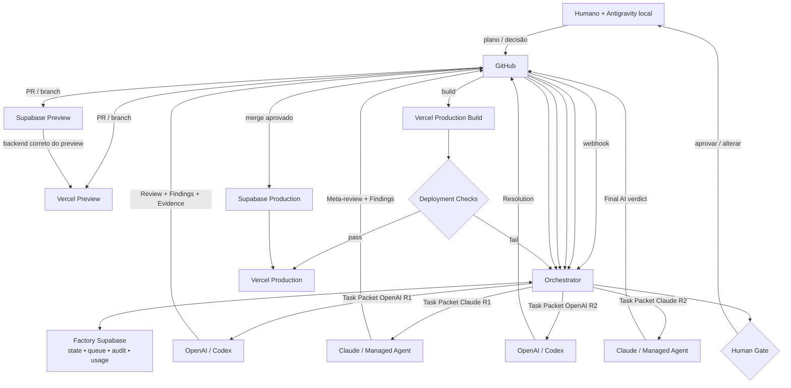

# Arquitetura da Inteligência dos Agentes — Fábrica Apps RNS

## Resumo executivo e decisões arquiteturais

A análise dos dois documentos fornecidos, combinada com a documentação oficial atual da OpenAI, Anthropic, GitHub, Supabase e Vercel em **20 de setembro de 2026**, confirma que a arquitetura proposta para a **Fábrica Apps RNS** é tecnicamente viável e que **não há motivo para alterar o plano central**. O documento do Reflex deve ser tratado como referência de desenho de Agent OS — principalmente constituição canônica, registries, skills, contratos, evidence, handoffs, permissions e adapters — e não como escopo funcional da RNS. fileciteturn0file0 O levantamento anterior da Fábrica Apps RNS já estabelece corretamente GitHub como fonte da verdade do software, Supabase como estado operacional da fábrica, Vercel como plano de execução/publicação e um Orchestrator determinístico acima dos modelos. fileciteturn0file1

A conclusão desta pesquisa é que devemos formalizar uma nova camada denominada, neste relatório, **RNS Intelligence Core**. Ela não substitui o Orchestrator, não transforma o Supabase em repositório de código e não transforma GitHub Actions em workflow engine. Sua responsabilidade é armazenar, versionar, testar e distribuir a inteligência operacional que OpenAI e Claude utilizarão ao construir aplicativos.

A arquitetura proposta fica assim:

> **Antigravity local + humano = planejamento e autoridade final.**  
> **GitHub = código, planos, inteligência canônica e ledger durável.**  
> **RNS Intelligence Core = constituição, papéis, skills, metodologia, conhecimento e protocolos.**  
> **OpenAI + Claude = trabalhadores cloud especializados e mutuamente revisores.**  
> **Orchestrator = máquina determinística de estados, autorização, routing, retries, budgets e handoffs.**  
> **Supabase = control plane persistente da fábrica.**  
> **Vercel + Supabase Preview = execução e evidência de cada aplicação produzida.**

Isso é particularmente compatível com a evolução recente dos fornecedores. O Codex lê `AGENTS.md`, suporta políticas hierárquicas por diretório e a OpenAI utiliza skills locais ao repositório em `.agents/skills/`; a própria OpenAI descreve `AGENTS.md` + skills + GitHub Actions como uma maneira de converter rotinas de engenharia em workflows repetíveis. citeturn18search2turn17search5 Anthropic segue um modelo semelhante: Claude Managed Agents pode carregar skills de `.claude/skills/` do repositório GitHub montado, e a documentação alerta explicitamente que essas skills passam a fazer parte da trust boundary do agente. citeturn14search0turn14search1

As URLs oficiais centrais dessa camada são:

`https://developers.openai.com/pt-BR/docs/agent-configuration/agents-md`

`https://developers.openai.com/pt-BR/blog/skills-agents-sdk`

`https://platform.claude.com/docs/pt-BR/managed-agents/skills`

A decisão mais importante é, portanto:

**OpenAI e Claude não devem possuir duas inteligências independentes. A Fábrica Apps RNS deve possuir uma única inteligência normativa e gerar duas projeções runtime-specific.**

```text
                   RNS INTELLIGENCE CORE
                           │
          ┌────────────────┴────────────────┐
          │                                 │
          ▼                                 ▼
   PROJEÇÃO OPENAI                   PROJEÇÃO CLAUDE
   AGENTS.md                         CLAUDE.md
   .agents/skills                    .claude/skills
   .codex/config                     Claude agent config
          │                                 │
          ▼                                 ▼
      OpenAI/Codex                   Claude/Managed Agent
          │                                 │
          └────────── Orchestrator ─────────┘
```

Outro ponto fundamental é separar **R1, o papel cognitivo de planejamento/orquestração**, do **Orchestrator de infraestrutura**. R1 pode sugerir decomposição, dependências e routing; ele não pode arbitrariamente mudar estados, criar loops, elevar privilégios ou decidir sozinho que outro modelo deve executar. Essas decisões pertencem ao Orchestrator determinístico.

A revisão dupla proposta pelo projeto também é adequada, mas precisa virar protocolo formal:

```text
Antigravity/Humano
       │
       │ Plano vN
       ▼
     GitHub
       │
       ▼
 OpenAI — Rodada 1
       │
       ▼
 Claude — Rodada 1
       │
       ▼
 OpenAI — Rodada 2
       │
       ▼
 Claude — Rodada 2 conclusiva
       │
       ▼
 Human Gate / Antigravity
```

O número normal de handoffs de IA será, portanto, **quatro**. Não haverá negociação infinita GPT↔Claude. Discordâncias que permaneçam materiais ao final serão elevadas para você. Essa ideia é coerente com o padrão de handoffs explícitos, anti-loop e limite de hops presente no sistema de referência fornecido. fileciteturn0file0

Para a integração cloud, tanto OpenAI quanto Anthropic já documentam **Workload Identity Federation com GitHub Actions**, permitindo trocar tokens OIDC emitidos pelo GitHub por credenciais de curta duração, em vez de manter chaves permanentes dos fornecedores em GitHub Secrets. citeturn16search0turn22search1turn22search5

URLs:

`https://developers.openai.com/pt-BR/api/docs/guides/workload-identity-federation/github-actions`

`https://platform.claude.com/docs/pt-BR/manage-claude/wif-providers/github-actions`

**Decisão de referência da arquitetura:**

| Área | Decisão recomendada |
|---|---|
| Autoridade humana | Humano operando Antigravity local |
| Fonte da verdade de código | GitHub |
| Fonte da inteligência dos agentes | `factory-intelligence/` no GitHub |
| Estado operacional | Factory Supabase |
| Workflow | Orchestrator determinístico |
| OpenAI | Adapter, não dono do workflow |
| Claude | Adapter, não dono do workflow |
| Revisão | OpenAI R1 → Claude R1 → OpenAI R2 → Claude R2 |
| Loop máximo padrão | Quatro execuções de revisão por etapa |
| Unidade de colaboração | Task Packet + artifact + SHA + Evidence |
| Unidade de código | branch/worktree por execução de escrita |
| Preview frontend | Vercel Preview |
| Preview backend | Supabase Branch |
| Produção | serviço de release + human/policy gate |
| Skills | canônicas no repo; projeções runtime-specific |
| Secrets | nunca entregues diretamente a coding agents |
| Subagentes cross-provider | proibidos inicialmente |
| Cross-provider | sempre via Orchestrator |
| Observabilidade | Supabase ledger + tracing/metrics externos quando necessário |

## Constituição, papéis, skills e sistema de conhecimento

A Constituição é a camada normativa de maior autoridade da inteligência RNS. Ela deve viver em `factory-intelligence/constitution/CONSTITUTION.md`, ser pequena, estável e protegida por CODEOWNERS. Skills, agentes e modelos **não podem alterá-la autonomamente**.

O sistema de referência Reflex já demonstra o valor de separar Constituição, registries, permissions, runtime adapters e continuidade. fileciteturn0file0 A RNS deve manter esse princípio, mas com papéis e fluxo próprios.

**Constituição proposta da Fábrica Apps RNS**

| Artigo | Regra normativa |
|---|---|
| Soberania humana | Nenhum agente ou modelo substitui a decisão humana em gates classificados como humanos. |
| Fonte canônica | Código, planos aprovados, constituição, skills e artefatos versionáveis pertencem ao GitHub. |
| Orquestração determinística | Modelos podem sugerir próximos passos; somente o Orchestrator efetiva transições do workflow. |
| Evidência antes de afirmação | “Concluído”, “testado”, “seguro” ou “publicável” exige Evidence verificável. |
| Imutabilidade de entrada | Toda execução registra `base_sha`, Task Packet e versões das regras utilizadas. |
| Isolamento | Um agente escritor opera em um workspace/worktree isolado por execução. |
| Autor ≠ juiz final | Mudança material não pode depender exclusivamente do mesmo modelo que a produziu. |
| Privilégio mínimo | Cada run recebe somente ferramentas, paths e permissões necessárias. |
| Produção segregada | Coding agents não recebem credenciais de produção. |
| Revisão limitada | GPT↔Claude não pode entrar em loop aberto; o ciclo padrão termina após a segunda rodada de Claude. |
| Discordância explícita | Divergências materiais são registradas como dados; não são escondidas por síntese textual. |
| Mudança de inteligência | Alterações em Constitution, permissions, agent registry e skills críticas exigem PR protegido. |
| Atualidade factual | Informações temporais de APIs, modelos, preços e versões precisam ser verificadas novamente em fontes oficiais. |
| Auditabilidade | Toda decisão operacional relevante precisa ser correlacionável a mission, task, run, SHA e agente. |
| Custo controlado | Execuções obedecem budgets; o agente não pode ampliar o próprio orçamento. |
| Falha segura | Em dúvida sobre privilégio, produção, segurança ou interpretação material do requisito, o estado deve bloquear ou escalar, não improvisar. |

É importante separar **autoridade normativa** de **precedência factual**. Misturar as duas produz problemas como um relatório histórico “vencer” o estado real da aplicação.

A hierarquia normativa proposta, dentro da RNS, é:

```text
Instrução humana explícita atual
        ↓
RNS Constitution
        ↓
Security / Permissions Policies
        ↓
Plano humano aprovado + Task Packet
        ↓
Agent Registry / Role Contract
        ↓
Engineering Methodology / Protocol
        ↓
Skill
        ↓
Knowledge
        ↓
Continuity / Historical Handoffs
        ↓
Suposição do modelo
```

A precedência factual deve ser diferente:

```text
Estado live verificado
        ↓
Código no SHA exato da branch relevante
        ↓
Migrations / configs versionadas
        ↓
Documentação canônica atual
        ↓
ADRs / continuity
        ↓
Handoffs históricos
        ↓
Memória da sessão/modelo
```

Esse segundo padrão é diretamente inspirado na regra de autoridade factual do documento Reflex. fileciteturn0file0

**Registry RNS R1–R9**

Os papéis abaixo preservam a taxonomia já definida para a Fábrica Apps RNS, sem importar automaticamente as responsabilidades R1–R9 do Reflex.

| ID | Papel RNS | Responsabilidade | Write default | Saída mínima |
|---|---|---|---|---|
| R1 | Orchestration Intelligence | interpretar missão, decompor, propor DAG, owners e sequência | read-only | plan/decomposition |
| R2 | Architecture | arquitetura, interfaces, ADRs, dependências, trade-offs | read-only por padrão | architecture review |
| R3 | Research | pesquisa técnica externa, versões, documentação, inovação | read-only | research evidence |
| R4 | Builder | implementação frontend/backend/infrastructure-as-code | workspace-write | patch/commit |
| R5 | Reviewer | code/plan review adversarial e cross-model | read-only | review + findings |
| R6 | QA & Testing | testes, regressões, integração, CI, evals | test/workspace limitado | test evidence |
| R7 | Security & Data | AppSec, Supabase, migrations, RLS, secrets | read-only; write via tarefa específica | security/data review |
| R8 | UX & Browser Verification | browser/E2E, UX, acessibilidade, interface | preview-only | browser evidence |
| R9 | Release & Evidence | reconciliar evidências, release readiness e fechamento | governance-only | final evidence ledger |

R1 não é o Orchestrator real. Ele é um **planner cognitivo**. O Orchestrator recebe sua proposta e valida se a transição é permitida.

Um registry machine-readable poderia começar assim:

```yaml
version: 1
registry: rns-agent-registry

roles:
  R1:
    name: orchestration-intelligence
    write_policy: read_only
    can_schedule_runs: false
    can_approve_human_gate: false
    default_skills:
      - plan-decomposition
      - dependency-analysis

  R2:
    name: architecture
    write_policy: read_only
    default_skills:
      - architecture-review
      - adr-authoring

  R3:
    name: research
    write_policy: read_only
    default_skills:
      - deep-research
      - source-validation

  R4:
    name: builder
    write_policy: workspace_write
    default_skills:
      - implementation
      - ci-repair

  R5:
    name: reviewer
    write_policy: read_only
    independent_review: true
    default_skills:
      - plan-review
      - code-review

  R6:
    name: qa-testing
    write_policy: test_workspace
    independent_review: true
    default_skills:
      - test-design
      - regression-analysis

  R7:
    name: security-data
    write_policy: read_only
    independent_review: true
    default_skills:
      - security-audit
      - rls-audit
      - migration-review

  R8:
    name: ux-browser-verification
    write_policy: preview_only
    default_skills:
      - browser-validation
      - accessibility-review

  R9:
    name: release-evidence
    write_policy: governance_only
    can_merge: false
    can_deploy_production: false
    default_skills:
      - evidence-synthesis
      - release-readiness
```

O `runtime` deliberadamente não aparece hardcoded no papel. O correto é:

```text
ROLE = R5 Reviewer
RUNTIME = OpenAI
MODEL = resolved-at-run-time
```

ou:

```text
ROLE = R5 Reviewer
RUNTIME = Anthropic
MODEL = resolved-at-run-time
```

Assim, o sistema pode executar o mesmo papel em fornecedores diferentes sem duplicar sua definição normativa.

**Primeiro catálogo de skills**

| Skill canônica | Papéis principais | Artefato esperado |
|---|---|---|
| `plan-decomposition` | R1 | DAG/etapas/dependências |
| `architecture-review` | R2/R5 | findings arquiteturais |
| `adr-authoring` | R2 | ADR |
| `deep-research` | R3 | evidence externa |
| `source-validation` | R3/R5 | verificação de afirmações |
| `implementation` | R4 | patch/commit |
| `frontend-build` | R4 | implementação UI |
| `backend-build` | R4 | implementação backend |
| `code-review` | R5 | review estruturado |
| `test-design` | R6 | matriz de teste |
| `ci-diagnosis` | R4/R6 | diagnóstico + correção |
| `migration-review` | R7 | avaliação de migration |
| `rls-audit` | R7 | matriz allow/deny |
| `security-audit` | R7 | findings AppSec |
| `browser-validation` | R8 | evidência browser/E2E |
| `accessibility-review` | R8 | findings a11y |
| `release-readiness` | R9 | verdict de release |
| `evidence-synthesis` | R9 | ledger final |

Para Codex, skills locais em `.agents/skills/` são hoje uma superfície documentada pela OpenAI. citeturn17search5 Para Claude Managed Agents, `.claude/skills/<skill>/SKILL.md` pode ser descoberto automaticamente quando o repositório é montado. citeturn14search0turn14search1

Isso justifica nossa estratégia:

```text
factory-intelligence/skills/     ← CANÔNICO
          │
          ├── compile → .agents/skills/
          │
          └── compile → .claude/skills/
```

Não recomendo symlinks como mecanismo principal de projeção. O mais previsível é gerar arquivos/copiar artefatos e manter um manifesto com hash, permitindo CI detectar drift.

**Metodologia de engenharia**

O workflow cognitivo padrão passa a ser:

```text
Intake humano
→ reconcile baseline
→ R1 decomposition
→ R2/R3 conforme necessidade
→ plano versionado
→ revisão dupla GPT↔Claude
→ human gate Antigravity
→ execução da etapa
→ deterministic verification
→ revisão cruzada
→ preview
→ evidence
→ aprovação da etapa
→ próxima etapa
→ release readiness
→ human release gate
```

Uma tarefa curta não precisa ativar os nove papéis. O Task Packet escolhe o menor conjunto necessário.

O sistema de conhecimento deve ser deliberadamente dividido em quatro classes:

| Classe | Propósito | Mutabilidade |
|---|---|---|
| Constitution | o que nunca deve ser violado | baixíssima |
| Methodology | como trabalhar | moderada |
| Knowledge | fatos técnicos e referências | alta/temporal |
| Continuity | o que aconteceu no projeto | append/reconcile |

Isso evita que um handoff antigo se transforme acidentalmente em política.

Para conhecimento temporal, cada registro deveria conter pelo menos:

```yaml
topic: anthropic-managed-agents
authority: reference
verified_at: 2026-09-20T00:00:00Z
freshness_policy: revalidate_before_material_use
sources:
  - https://platform.claude.com/docs/en/managed-agents/skills
```

A fábrica não deve “memorizar para sempre” preços, modelos, limites de API ou comportamento experimental; deve memorizar **como verificar novamente**.

## Repositório canônico, bootloaders, schemas e governança Git

A árvore recomendada para o repositório da fábrica é:

```text
/
├── AGENTS.md
├── CLAUDE.md
├── README.md
│
├── factory-intelligence/
│   ├── constitution/
│   │   ├── CONSTITUTION.md
│   │   ├── AUTHORITY.md
│   │   ├── HUMAN_GATES.md
│   │   ├── SECURITY.md
│   │   └── EVIDENCE_POLICY.md
│   │
│   ├── registry/
│   │   ├── agents.yaml
│   │   ├── skills.yaml
│   │   ├── runtimes.yaml
│   │   ├── models.yaml
│   │   └── permissions.yaml
│   │
│   ├── methodology/
│   │   ├── PLANNING.md
│   │   ├── SOFTWARE_ENGINEERING.md
│   │   ├── RESEARCH.md
│   │   ├── REVIEW.md
│   │   ├── TESTING.md
│   │   ├── SECURITY.md
│   │   ├── DATA_MIGRATIONS.md
│   │   ├── UX.md
│   │   └── RELEASE.md
│   │
│   ├── protocols/
│   │   ├── DOUBLE_REVIEW.md
│   │   ├── DISAGREEMENT.md
│   │   ├── HANDOFF.md
│   │   ├── RETRY.md
│   │   └── HUMAN_GATE.md
│   │
│   ├── skills/
│   │   ├── plan-decomposition/
│   │   │   └── SKILL.md
│   │   ├── architecture-review/
│   │   │   └── SKILL.md
│   │   ├── deep-research/
│   │   ├── code-review/
│   │   ├── migration-review/
│   │   ├── rls-audit/
│   │   ├── browser-validation/
│   │   └── release-readiness/
│   │
│   ├── schemas/
│   │   ├── task-packet.schema.json
│   │   ├── agent-output.schema.json
│   │   ├── review.schema.json
│   │   ├── finding.schema.json
│   │   ├── evidence.schema.json
│   │   └── handoff.schema.json
│   │
│   ├── knowledge/
│   │   ├── architecture/
│   │   ├── frontend/
│   │   ├── backend/
│   │   ├── database/
│   │   ├── security/
│   │   └── providers/
│   │
│   ├── continuity/
│   │   ├── ADR/
│   │   ├── decisions/
│   │   ├── known-risks/
│   │   └── unresolved/
│   │
│   └── evals/
│       ├── datasets/
│       ├── cases/
│       ├── rubrics/
│       └── baselines/
│
├── .agents/
│   ├── skills/                 # projeção gerada para OpenAI
│   └── projection-manifest.json
│
├── .claude/
│   ├── skills/                 # projeção gerada para Claude
│   ├── agents/
│   └── projection-manifest.json
│
├── .codex/
│   ├── config.toml
│   ├── profiles/
│   └── projection-manifest.json
│
├── orchestrator/
│   ├── api/
│   ├── engine/
│   ├── adapters/
│   │   ├── openai/
│   │   ├── anthropic/
│   │   ├── github/
│   │   ├── supabase/
│   │   └── vercel/
│   ├── policy/
│   └── workers/
│
├── supabase/
│   ├── migrations/
│   ├── functions/
│   └── tests/
│
├── scripts/
│   └── intelligence/
│       ├── build-projections.ts
│       ├── validate-registry.ts
│       ├── validate-schemas.ts
│       └── check-drift.ts
│
└── .github/
    ├── CODEOWNERS
    └── workflows/
        ├── intelligence-ci.yml
        ├── application-ci.yml
        ├── security.yml
        └── preview-e2e.yml
```

OpenAI documenta que Codex lê `AGENTS.md` antes do trabalho, combina instruções hierarquicamente e permite `AGENTS.override.md` mais próximo do diretório sobrescrever orientações anteriores. A documentação também informa limite agregado padrão de 32 KiB para essa cadeia, o que reforça nossa decisão de manter o bootloader curto e mover conhecimento volumoso para documentos/skills carregados sob demanda. citeturn18search0turn18search2

**AGENTS.md recomendado**

```md
# Fábrica Apps RNS — OpenAI Bootloader

Você está operando dentro da Fábrica Apps RNS.

## Autoridade

Leia e obedeça, nesta ordem:

1. factory-intelligence/constitution/CONSTITUTION.md
2. factory-intelligence/constitution/SECURITY.md
3. factory-intelligence/registry/permissions.yaml
4. o Task Packet fornecido para esta execução
5. factory-intelligence/registry/agents.yaml
6. factory-intelligence/methodology/
7. skills autorizadas em .agents/skills/

## Regras invariantes

- Nunca altere produção diretamente.
- Nunca amplie suas próprias permissões.
- Trabalhe somente sobre o base_sha informado.
- Não modifique paths fora de allowed_paths.
- Não trate memória histórica como estado live.
- Toda conclusão material deve apontar Evidence.
- Não inicie outro fornecedor de IA diretamente.
- Cross-provider handoff pertence exclusivamente ao Orchestrator.
- Em revisão, produza saída compatível com review.schema.json.
- Em implementação, produza saída compatível com agent-output.schema.json.
- Quando houver conflito material entre fontes, registre-o; não o esconda.

## Fonte canônica

A inteligência normativa vive em factory-intelligence/.
Arquivos .agents/, .claude/ e .codex/ são projeções e não redefinem a Constituição.
```

**CLAUDE.md recomendado**

```md
# Fábrica Apps RNS — Claude Bootloader

Você está executando um papel formal da Fábrica Apps RNS.

Antes de trabalhar, carregue:

- factory-intelligence/constitution/CONSTITUTION.md
- factory-intelligence/constitution/SECURITY.md
- factory-intelligence/registry/permissions.yaml
- o Task Packet desta execução
- a definição do papel R1-R9 atribuída
- somente as metodologias e skills necessárias à tarefa

Regras:

- Produção é inacessível a coding agents.
- Não faça handoff direto para OpenAI.
- Não crie loops de revisão.
- Não mude Constitution, permissions ou registries sem tarefa humana específica.
- Fixe sua análise ao base_sha recebido.
- Diferencie fato verificado, inferência e recomendação.
- Findings devem obedecer finding.schema.json.
- Evidence deve obedecer evidence.schema.json.
- Na segunda rodada Claude, encerre com um verdict conclusivo:
  READY_FOR_HUMAN_APPROVAL, CHANGES_REQUIRED ou BLOCKED.

A fonte normativa é factory-intelligence/.
.claude/ é apenas projeção runtime-specific.
```

Claude Managed Agents pode descobrir automaticamente `.claude/skills` em um repositório montado, inclusive seus `SKILL.md` e recursos auxiliares. citeturn14search0

**Task Packet de exemplo**

Campos desconhecidos não recebem números fictícios: permanecem `null`.

```json
{
  "schema_version": "1.0",
  "mission_id": "mis_01",
  "task_id": "tsk_01",
  "run_id": "run_01",
  "role": "R5",
  "runtime": "openai",
  "model": null,
  "repository": "rns/fabrica-apps-rns",
  "base_sha": "0123456789abcdef0123456789abcdef01234567",
  "branch": "review/tsk_01-openai-r1",
  "objective": "Revisar o plano de autenticação antes da implementação.",
  "acceptance_criteria": [
    "Identificar riscos arquiteturais materiais",
    "Classificar findings por severidade",
    "Apontar evidência para afirmações verificáveis"
  ],
  "allowed_paths": [
    "docs/plans/authentication/**",
    "factory-intelligence/**"
  ],
  "forbidden_paths": [
    ".github/workflows/**",
    "supabase/migrations/**"
  ],
  "required_skills": [
    "architecture-review",
    "security-audit"
  ],
  "permissions": {
    "filesystem": "read_only",
    "github": "read",
    "supabase": "metadata_read",
    "vercel": "none",
    "production": "deny"
  },
  "budget": {
    "max_cost_usd": null,
    "max_wall_seconds": null,
    "max_review_hops": 4
  },
  "review_policy": {
    "sequence": [
      "openai_r1",
      "claude_r1",
      "openai_r2",
      "claude_r2"
    ],
    "human_gate_after": "claude_r2"
  },
  "expected_artifacts": [
    "review.json",
    "findings.json"
  ]
}
```

Os schemas seguintes são a especificação RNS proposta. A recomendação é JSON Schema Draft 2020-12 e validação tanto no Orchestrator quanto em CI.

**`task-packet.schema.json`**

```json
{
  "$schema": "https://json-schema.org/draft/2020-12/schema",
  "$id": "https://rns.local/schemas/task-packet.schema.json",
  "type": "object",
  "additionalProperties": false,
  "required": [
    "schema_version",
    "mission_id",
    "task_id",
    "run_id",
    "role",
    "runtime",
    "repository",
    "base_sha",
    "objective",
    "acceptance_criteria",
    "allowed_paths",
    "forbidden_paths",
    "required_skills",
    "permissions",
    "budget",
    "expected_artifacts"
  ],
  "properties": {
    "schema_version": { "type": "string" },
    "mission_id": { "type": "string", "minLength": 1 },
    "task_id": { "type": "string", "minLength": 1 },
    "run_id": { "type": "string", "minLength": 1 },
    "role": {
      "enum": ["R1","R2","R3","R4","R5","R6","R7","R8","R9"]
    },
    "runtime": {
      "enum": ["openai","anthropic","antigravity","deterministic"]
    },
    "model": { "type": ["string","null"] },
    "repository": { "type": "string" },
    "base_sha": {
      "type": "string",
      "pattern": "^[0-9a-f]{40,64}$"
    },
    "branch": { "type": ["string","null"] },
    "objective": { "type": "string", "minLength": 1 },
    "acceptance_criteria": {
      "type": "array",
      "items": { "type": "string" }
    },
    "allowed_paths": {
      "type": "array",
      "items": { "type": "string" }
    },
    "forbidden_paths": {
      "type": "array",
      "items": { "type": "string" }
    },
    "required_skills": {
      "type": "array",
      "items": { "type": "string" }
    },
    "permissions": { "type": "object" },
    "budget": {
      "type": "object",
      "required": ["max_cost_usd","max_wall_seconds","max_review_hops"],
      "properties": {
        "max_cost_usd": { "type": ["number","null"], "minimum": 0 },
        "max_wall_seconds": { "type": ["integer","null"], "minimum": 1 },
        "max_review_hops": { "type": "integer", "minimum": 1, "maximum": 4 }
      }
    },
    "review_policy": { "type": ["object","null"] },
    "expected_artifacts": {
      "type": "array",
      "items": { "type": "string" }
    }
  }
}
```

**`agent-output.schema.json`**

```json
{
  "$schema": "https://json-schema.org/draft/2020-12/schema",
  "$id": "https://rns.local/schemas/agent-output.schema.json",
  "type": "object",
  "additionalProperties": false,
  "required": [
    "task_id",
    "run_id",
    "input_sha",
    "status",
    "summary",
    "artifacts",
    "finding_ids",
    "evidence_ids",
    "usage"
  ],
  "properties": {
    "task_id": { "type": "string" },
    "run_id": { "type": "string" },
    "input_sha": { "type": "string" },
    "output_sha": { "type": ["string","null"] },
    "status": {
      "enum": ["completed","changes_required","blocked","failed"]
    },
    "summary": { "type": "string" },
    "artifacts": {
      "type": "array",
      "items": {
        "type": "object",
        "required": ["type","uri","sha256"],
        "properties": {
          "type": { "type": "string" },
          "uri": { "type": "string" },
          "sha256": { "type": "string" }
        }
      }
    },
    "finding_ids": {
      "type": "array",
      "items": { "type": "string" }
    },
    "evidence_ids": {
      "type": "array",
      "items": { "type": "string" }
    },
    "usage": {
      "type": "object",
      "properties": {
        "input_tokens": { "type": ["integer","null"] },
        "cached_input_tokens": { "type": ["integer","null"] },
        "output_tokens": { "type": ["integer","null"] },
        "cost_usd": { "type": ["number","null"] },
        "wall_ms": { "type": ["integer","null"] }
      }
    }
  }
}
```

**`review.schema.json`**

```json
{
  "$schema": "https://json-schema.org/draft/2020-12/schema",
  "$id": "https://rns.local/schemas/review.schema.json",
  "type": "object",
  "additionalProperties": false,
  "required": [
    "review_id",
    "task_id",
    "reviewer_runtime",
    "reviewer_role",
    "round",
    "target_sha",
    "verdict",
    "finding_ids",
    "unresolved_finding_ids"
  ],
  "properties": {
    "review_id": { "type": "string" },
    "task_id": { "type": "string" },
    "reviewer_runtime": {
      "enum": ["openai","anthropic","antigravity","human"]
    },
    "reviewer_role": {
      "enum": ["R2","R3","R5","R6","R7","R8","R9"]
    },
    "round": { "type": "integer", "minimum": 1, "maximum": 2 },
    "target_sha": { "type": "string" },
    "prior_review_id": { "type": ["string","null"] },
    "comments_on_prior_work": { "type": "boolean" },
    "verdict": {
      "enum": [
        "APPROVE_AI_STAGE",
        "CHANGES_REQUIRED",
        "BLOCKED",
        "READY_FOR_HUMAN_APPROVAL"
      ]
    },
    "finding_ids": {
      "type": "array",
      "items": { "type": "string" }
    },
    "unresolved_finding_ids": {
      "type": "array",
      "items": { "type": "string" }
    },
    "summary": { "type": "string" }
  }
}
```

**`finding.schema.json`**

```json
{
  "$schema": "https://json-schema.org/draft/2020-12/schema",
  "$id": "https://rns.local/schemas/finding.schema.json",
  "type": "object",
  "additionalProperties": false,
  "required": [
    "finding_id",
    "category",
    "severity",
    "claim",
    "status",
    "blocks_progress",
    "evidence_ids"
  ],
  "properties": {
    "finding_id": { "type": "string" },
    "category": {
      "enum": [
        "architecture",
        "correctness",
        "security",
        "data",
        "testing",
        "performance",
        "ux",
        "operations",
        "research",
        "requirement"
      ]
    },
    "severity": {
      "enum": ["info","low","medium","high","critical"]
    },
    "claim": { "type": "string" },
    "recommendation": { "type": ["string","null"] },
    "status": {
      "enum": ["open","accepted","rejected","resolved","deferred"]
    },
    "blocks_progress": { "type": "boolean" },
    "evidence_ids": {
      "type": "array",
      "items": { "type": "string" }
    },
    "disposition_reason": { "type": ["string","null"] }
  }
}
```

**`evidence.schema.json`**

```json
{
  "$schema": "https://json-schema.org/draft/2020-12/schema",
  "$id": "https://rns.local/schemas/evidence.schema.json",
  "type": "object",
  "additionalProperties": false,
  "required": [
    "evidence_id",
    "type",
    "source",
    "observed_at",
    "collector",
    "integrity"
  ],
  "properties": {
    "evidence_id": { "type": "string" },
    "type": {
      "enum": [
        "code",
        "test",
        "ci",
        "runtime",
        "browser",
        "database",
        "external_source",
        "human"
      ]
    },
    "source": { "type": "string" },
    "observed_at": {
      "type": "string",
      "format": "date-time"
    },
    "collector": { "type": "string" },
    "commit_sha": { "type": ["string","null"] },
    "artifact_sha256": { "type": ["string","null"] },
    "claim_ids": {
      "type": "array",
      "items": { "type": "string" }
    },
    "integrity": {
      "enum": ["verified","reported","inferred","pending"]
    }
  }
}
```

**`handoff.schema.json`**

```json
{
  "$schema": "https://json-schema.org/draft/2020-12/schema",
  "$id": "https://rns.local/schemas/handoff.schema.json",
  "type": "object",
  "additionalProperties": false,
  "required": [
    "handoff_id",
    "mission_id",
    "task_id",
    "from_runtime",
    "to_runtime",
    "hop",
    "reason",
    "input_sha",
    "artifact_ids",
    "next_action"
  ],
  "properties": {
    "handoff_id": { "type": "string" },
    "mission_id": { "type": "string" },
    "task_id": { "type": "string" },
    "from_runtime": {
      "enum": ["human","antigravity","openai","anthropic","orchestrator"]
    },
    "to_runtime": {
      "enum": ["human","antigravity","openai","anthropic","orchestrator"]
    },
    "hop": { "type": "integer", "minimum": 0, "maximum": 4 },
    "reason": { "type": "string" },
    "input_sha": { "type": "string" },
    "artifact_ids": {
      "type": "array",
      "items": { "type": "string" }
    },
    "finding_ids": {
      "type": "array",
      "items": { "type": "string" }
    },
    "next_action": { "type": "string" },
    "idempotency_key": { "type": "string" }
  }
}
```

**CODEOWNERS recomendado**

```text
# Constituição e autoridade humana
/factory-intelligence/constitution/     @rns/human-governance @rns/security

# Registries e permissões
/factory-intelligence/registry/         @rns/ai-platform @rns/security
/factory-intelligence/protocols/        @rns/ai-platform @rns/security

# Inteligência executável
/factory-intelligence/skills/           @rns/ai-platform @rns/security
/.agents/                               @rns/ai-platform
/.claude/                               @rns/ai-platform
/.codex/                                @rns/ai-platform

# Automação privilegiada
/.github/workflows/                     @rns/platform @rns/security
/orchestrator/                          @rns/platform @rns/security

# Banco
/supabase/migrations/                   @rns/data @rns/security
/supabase/functions/                    @rns/data @rns/platform

# Release
/factory-intelligence/methodology/RELEASE.md @rns/human-governance @rns/platform
```

CODEOWNERS por si só não bloqueia merge; a proteção precisa exigir Code Owner review por ruleset/branch protection. GitHub Rulesets permite exigir PR antes de merge, status checks, Code Owner review, resolução de comentários, bloquear force push, bloquear merges com determinados achados de secret/code scanning e exigir deployments. citeturn20search1turn20search2

Para `main`, eu configuraria:

```text
Require pull request
Require code-owner review
Dismiss stale approvals
Require approval of latest reviewable push
Require conversation resolution
Require status checks
Require Supabase Preview check
Require security checks
Block force pushes
Block deletion
No general bypass
```

URL oficial:

`https://docs.github.com/en/repositories/configuring-branches-and-merges-in-your-repository/managing-rulesets/available-rules-for-rulesets`

## Protocolo GPT↔Claude, Orchestrator e ciclo operacional

A revisão dupla deve ser tratada como **protocolo de estado**, e não como conversa informal.

O ciclo formal por etapa é:

| Passagem | Runtime | Função |
|---|---|---|
| OpenAI R1 | OpenAI | revisão independente inicial |
| Claude R1 | Anthropic | revisar objeto + criticar OpenAI R1 |
| OpenAI R2 | OpenAI | responder Claude, corrigir/rejeitar objeções |
| Claude R2 | Anthropic | síntese conclusiva e encaminhamento ao human gate |

A segunda passagem Claude tem comportamento especial: ela **não inicia uma terceira rodada**.

Seu output final é exatamente um destes:

```text
READY_FOR_HUMAN_APPROVAL
CHANGES_REQUIRED
BLOCKED
```

**OpenAI R1** recebe o plano/artefato original, SHA, papel, critérios e skills. Não recebe instrução para “concordar”; precisa analisar independentemente.

**Claude R1** recebe:

```text
original
+ OpenAI R1 review
+ findings
+ evidence
```

Sua obrigação é analisar tanto o projeto quanto a revisão anterior:

```text
O finding do OpenAI é factual?
A evidência é suficiente?
Existe risco omitido?
Existe falso positivo?
A solução sugerida introduz outro problema?
```

**OpenAI R2** recebe toda a trilha e precisa resolver objeções materialmente válidas, rejeitar objeções infundadas com justificativa e marcar divergências ainda abertas.

**Claude R2** faz a conclusão. Não deve continuar debate aberto.

Os critérios de encerramento são:

| Condição | Resultado |
|---|---|
| Critérios de aceitação satisfeitos e nenhum finding bloqueante aberto | `READY_FOR_HUMAN_APPROVAL` |
| Problemas corrigíveis permanecem | `CHANGES_REQUIRED` |
| Segurança crítica, requisito impossível, inconsistência fundamental ou dependência ausente | `BLOCKED` |
| Limite de quatro hops alcançado com discordância material | `READY_FOR_HUMAN_APPROVAL` + disagreement ou `BLOCKED`, conforme materialidade |
| `base_sha` mudou durante a revisão de modo material | ciclo invalidado; nova versão |
| Schema de saída inválido | erro técnico; retry controlado |
| Provider/network transient | retry técnico |
| Budget esgotado | `BLOCKED_BUDGET` operacional |
| Human gate rejeita | nova versão ou encerramento |

A ideia essencial é separar **retry técnico** de **nova revisão semântica**. Um `HTTP 429` não consome uma rodada cognitiva. Uma nova análise do conteúdo, sim.

**Protocolo de discordância**

```json
{
  "disagreement_id": "dis_01",
  "finding_id": "fnd_07",
  "type": "architectural",
  "openai_position": "Redis is required",
  "anthropic_position": "Postgres queue is sufficient",
  "openai_evidence": ["ev_21"],
  "anthropic_evidence": ["ev_22", "ev_23"],
  "materiality": "medium",
  "resolved": false,
  "human_required": true
}
```

Categorias recomendadas:

| Tipo | Regra |
|---|---|
| factual | procurar Evidence verificável |
| security | unresolved high/critical bloqueia |
| requirement | humano é autoridade |
| architectural | pode ser escalado com trade-offs |
| implementation | testes podem arbitrar |
| preference | não deve bloquear por padrão |

O sistema **não conta votos**. Dois agentes dizendo a mesma coisa não transformam automaticamente uma afirmação em verdade.

A máquina de estados principal deveria ser persistida no Factory Supabase:

```text
DRAFT
  ↓
PLAN_READY
  ↓
OPENAI_R1_RUNNING
  ↓
CLAUDE_R1_RUNNING
  ↓
OPENAI_R2_RUNNING
  ↓
CLAUDE_R2_RUNNING
  ↓
HUMAN_GATE
  ↓
APPROVED
  ↓
IMPLEMENTING
  ↓
VERIFYING
  ↓
PR_READY
  ↓
PREVIEW_READY
  ↓
STAGE_HUMAN_GATE
  ↓
NEXT_STAGE / RELEASE_READY
  ↓
RELEASE_GATE
  ↓
DEPLOYING
  ↓
VERIFYING_PRODUCTION
  ↓
COMPLETED
```

Em paralelo existem estados terminais/intermediários:

```text
FAILED_TRANSIENT
FAILED_PERMANENT
BLOCKED
CANCELLED
SUPERSEDED
CHANGES_REQUIRED
```

A execução não pode ser inferida a partir da conversa do agente. Ela precisa existir como linha persistente em `runs`.

**Envelope de eventos**

```json
{
  "event_id": "evt_01",
  "event_type": "review.completed",
  "aggregate_type": "task",
  "aggregate_id": "tsk_01",
  "mission_id": "mis_01",
  "run_id": "run_04",
  "producer": "anthropic-adapter",
  "sequence": 18,
  "occurred_at": "2026-09-20T12:00:00Z",
  "base_sha": "0123456789abcdef0123456789abcdef01234567",
  "idempotency_key": "review:tsk_01:claude:r2:01234567",
  "payload": {
    "review_id": "rev_04",
    "verdict": "READY_FOR_HUMAN_APPROVAL"
  }
}
```

`idempotency_key` deve possuir unique constraint. O handler primeiro registra/deduplica e somente depois tenta realizar a transição.

Uma chave para uma execução de revisão pode ser derivada deterministicamente de:

```text
task_id
+ phase
+ round
+ runtime
+ base_sha
+ task_packet_version
```

Supabase Queues atualmente fornece fila durável baseada em Postgres/pgmq, garantia de entrega e uma visibility window na qual uma mensagem fica reservada ao consumidor. citeturn21search2 Isso é útil para leases, mas **não elimina nossa necessidade de handlers idempotentes**: uma operação externa pode ter sido executada antes da falha do consumidor.

A regra de retry recomendada é:

```text
transport/network/429/5xx
    → retry automático com backoff+jitter

schema/output parsing
    → uma nova tentativa corretiva do mesmo run-policy

semantic rejection
    → não é retry
    → nova passagem do protocolo ou nova versão

security/policy violation
    → não é retry
    → BLOCKED

human rejection
    → não é retry
    → nova task/version
```

Limites temporais, número de retries de transporte, budgets e lease TTL devem ser configuração operacional e permanecem **UNSPECIFIED até termos benchmark do runtime**, em vez de inventarmos valores agora.

A integração lógica completa é:



Esse desenho requer que GitHub seja o ledger, mas **não** o estado do workflow. O levantamento anterior já concluiu corretamente que GitHub Actions deve executar jobs e checks, enquanto estado, leases, budgets, retries e aprovações vivem no Supabase/Orchestrator. fileciteturn0file1

A OpenAI oferece `openai/codex-action@v1` para rodar Codex em jobs de CI, aplicar patches e publicar reviews; a própria documentação recomenda controlar sandbox e tratar conteúdo de PR como potencial fonte de prompt injection. citeturn17search0 Isso o torna uma excelente superfície para checks/reviews, mas não transforma Actions em nosso Orchestrator.

OpenAI Agents API também possui sessões persistentes executadas assincronamente e acompanhamento por streaming/webhooks, o que a torna outra superfície adequada para o adapter. citeturn16search3

**Workspace rule**

```text
run_001
  → worktree /workspace/run_001
  → branch rns/task-148-openai

run_002
  → worktree /workspace/run_002
  → branch rns/task-148-claude-review
```

Nunca:

```text
OpenAI ─┐
        ├─ escrevendo simultaneamente em ./repo
Claude ─┘
```

O GitHub App da Fábrica é a identidade do control plane. GitHub Apps começam sem permissões e a documentação recomenda selecionar apenas o conjunto mínimo necessário; installation access tokens expiram atualmente após uma hora e podem ser escopados. citeturn19search9turn19search1

Para a Fábrica, eu dividiria identidades:

| Identidade | Poder |
|---|---|
| `rns-control-app` | webhook, PR/check/status, branch metadata |
| `rns-worker-app` | branch-specific content write quando autorizado |
| `rns-release-service` | operações de release restritas |
| coding agent | nenhuma credencial GitHub administrativa |

Essa separação reduz o blast radius caso um agente seja comprometido.

## Integrações e alternativas técnicas

O Factory Supabase deve hospedar o **control plane persistente**, não o código dos aplicativos. Supabase hoje posiciona explicitamente “Supabase for Platforms” para plataformas e AI builders e expõe Management API para criação e administração programática de projetos. citeturn21search3

URL:

`https://supabase.com/docs/guides/integrations/supabase-for-platforms`

O schema inicial recomendado do Factory Supabase é:

```text
organizations
users
memberships

apps
app_specs
repositories

missions
tasks
task_dependencies

runs
run_events
leases
idempotency_keys

artifacts
reviews
findings
evidences
handoffs

approvals
human_gates

agent_profiles
runtime_profiles
skill_versions
model_snapshots

pull_requests
ci_checks
preview_environments
deployments

usage_records
cost_records
eval_runs
eval_results

audit_events
secret_refs
```

O código real, migrations e inteligência permanecem no GitHub.

**Onde executar o Orchestrator**

| Alternativa | Pontos fortes | Problemas | Decisão RNS |
|---|---|---|---|
| Supabase Edge Functions | excelente webhook/API gateway; proximidade do DB; simples | duração/CPU limitadas; inadequada para sessões longas | usar para ingestão, auth e commands curtos |
| GitHub Actions | ótimo CI, checkout, checks, segurança Git, Codex Action | estado efêmero; ruim para leases/DAGs/long-running workflow engine | usar como executor determinístico/CI |
| External worker/orchestrator | sessões longas; worktrees; cancelamento; controle de recursos | infraestrutura adicional | usar para engine e workers |
| Híbrido | cada componente faz o que sabe fazer | arquitetura mais explícita | **recomendado** |

Supabase Edge Functions suporta background tasks, mas continua sujeita a limites de wall-clock, CPU e memória; o runtime encerra a função ao alcançar esses limites. citeturn22search8 Portanto:

```text
GitHub Webhook
     ↓
Edge Function
     ↓
verify signature
normalize event
persist event
enqueue
return 2xx
     ↓
External Worker
     ↓
OpenAI / Claude
```

e não:

```text
GitHub Webhook
     ↓
Edge Function
     ↓
Claude trabalhando por longo período
```

**Adapters de agente**

| Superfície | Vantagem | Restrição | Uso recomendado |
|---|---|---|---|
| OpenAI Codex GitHub Action | integração CI direta e output estruturável | bound ao runner/job | reviews/checks previsíveis |
| OpenAI Codex worker/CLI/SDK | controle completo do worktree | nós operamos runtime | implementação |
| OpenAI Agents API | sessão assíncrona gerenciada | maior dependência de runtime do fornecedor | workload gerenciado |
| Claude Managed Agents | sessão gerenciada, skills, repo mount | atualmente Beta | adapter Claude cloud principal candidato |
| Claude Code worker | alinhamento com experiência Claude Code | execução precisa ser governada pelo wrapper | alternativa/self-managed |

Claude Managed Agents é atualmente documentado como Beta, e suas skills podem ser anexadas ou descobertas do repositório GitHub. citeturn14search0 Essa condição de Beta deve constar no risk register: o Adapter Contract precisa impedir que o domínio da fábrica dependa diretamente do contrato da Anthropic.

A interface deve ser nossa:

```ts
interface AgentAdapter {
  start(task: TaskPacket): Promise<RunHandle>;
  resume(runId: string, input: unknown): Promise<RunHandle>;
  cancel(runId: string): Promise<void>;
  getEvents(runId: string): AsyncIterable<AgentEvent>;
  getArtifacts(runId: string): Promise<Artifact[]>;
  getUsage(runId: string): Promise<Usage>;
}
```

Se Claude Managed Agents mudar, substituímos o adapter, não o Orchestrator.

**Onde armazenar skills**

| Alternativa | Versionamento | Runtime-native | Risco de drift | Recomendação |
|---|---:|---:|---:|---|
| somente repo | excelente | alto | baixo | boa |
| somente external skill store | separado do código | depende do fornecedor | alto | não canônico |
| duplicadas manualmente `.agents` + `.claude` | razoável | alto | **muito alto** | rejeitar |
| canonical repo + projections | excelente | alto | baixo se CI validar | **recomendado** |
| canonical repo + upload versionado para provider | excelente | alto | baixo com manifest | útil quando runtime exigir |

No caso Claude, anexar muitas skills também aumenta o contexto/startup da sessão; a documentação recomenda anexar apenas as necessárias. citeturn14search0 Isso reforça `required_skills` no Task Packet em vez de disponibilizar tudo indiscriminadamente.

**GitHub + Supabase + Vercel preview**

Supabase Branching cria ambientes isolados e preview branches efêmeras; a integração GitHub acompanha branches/PRs, reconstrói o schema a partir das migrations do repositório e não clona os dados de produção para o preview. citeturn22search2turn22search4

Supabase recomenda inclusive tornar o check de preview obrigatório no GitHub para impedir merge de migrations inválidas. citeturn22search4

URL:

`https://supabase.com/docs/guides/deployment/branching/github-integration`

A integração Supabase↔Vercel consegue sincronizar a branch do hosting com a branch Supabase correspondente e atualizar as variáveis do preview. A documentação alerta que podem existir condições de corrida entre a injeção das variáveis e a construção do deployment e informa que a integração força um redeploy do deployment mais recente do PR para reconciliar isso. citeturn22search9

Portanto, o Orchestrator não deve declarar o preview pronto ao receber apenas um evento Vercel.

Ele espera:

```text
github.pr.open
        │
        ├─ supabase.preview.ready
        │
        └─ vercel.preview.ready
                 │
                 ▼
          preview_pair_ready
                 │
                 ▼
              R8/E2E
```

Vercel gera preview deployments para commits/PRs e production deployments para a production branch configurada. citeturn12search1turn12search6

URL:

`https://vercel.com/docs/git`

Para produção, recomendo não fazer:

```text
merge == usuários recebem código
```

Vercel Deployment Checks permite criar o production build e manter sua promoção bloqueada até checks selecionados serem aprovados. citeturn12search0

O fluxo fica:

```text
merge
→ production build
→ deployment checks
→ smoke/E2E/security
→ release approval
→ promote/alias
```

URL:

`https://vercel.com/docs/deployment-checks`

Essa distinção entre **merge gate** e **release gate** é particularmente importante numa fábrica que permitirá agentes escreverem código autonomamente.

## Segurança, evals, telemetria e observabilidade

A principal nova trust boundary da Fábrica Apps RNS não é apenas o código gerado. É também a **inteligência que instrui os agentes**.

Anthropic alerta expressamente que uma skill do repositório é uma instrução de agente: qualquer pessoa capaz de alterar aquela skill pode mudar o comportamento da sessão, e ferramentas como Bash ou acesso web ampliam o alcance dessas instruções. citeturn14search0

Isso significa:

```text
SKILL.md
```

deve ser tratado quase como:

```text
workflow privilegiado
```

e não como documentação comum.

**Security baseline**

| Controle | Política RNS |
|---|---|
| Constitution | human CODEOWNER obrigatório |
| `permissions.yaml` | human/security review obrigatório |
| Skills | PR + CODEOWNERS + projection hash |
| Model-generated skill changes | nunca auto-merge |
| Production credentials | indisponíveis a coding agents |
| GitHub identity | GitHub App com least privilege |
| Provider auth | WIF/OIDC preferido |
| Workspaces | efêmeros/isolados |
| Cross-provider calls | apenas Orchestrator |
| Untrusted PR | sem privileged secrets |
| Supabase secret key | apenas backend/orchestrator |
| RLS | todas as tabelas expostas |
| Preview data | sintético/anônimo; não copiar produção |
| Webhooks | assinatura verificada + dedup |
| Agent output | schema validation antes de consumir |
| Commands | allowlist/denylist/policy engine |
| Network | egress restrito conforme papel |
| Audit | append-only logical ledger |
| Release | separação coding/release identity |

GitHub recomenda explicitamente evitar executar código de PR não confiável em `pull_request_target` com credenciais privilegiadas; esse padrão pode resultar no chamado “pwn request”. `pull_request` é a opção mais segura quando não é necessário contexto privilegiado, e runners que lidam com código não confiável devem ser isolados e efêmeros. citeturn19search0turn19search5

Portanto, qualquer código produzido por um agente deve começar com classificação:

```text
UNTRUSTED_GENERATED_CODE
```

mesmo quando o agente é nosso.

OpenAI e Anthropic agora oferecem WIF para GitHub Actions, eliminando em muitos fluxos a necessidade de colocar uma API key permanente no repositório. citeturn16search0turn22search5 Recomendo que esse seja o padrão das integrações CI.

No Factory Supabase, a segurança exige atenção especial: a documentação atual recomenda habilitar RLS em todas as tabelas expostas; grants e policies são verificações separadas, e `secret key`/`service_role` bypassa RLS e deve permanecer server-side. citeturn22search0

Logo, os agentes **não recebem a secret key do Factory Supabase**.

O padrão é:

```text
Agent
  │
  ▼
RNS Tool API / MCP
  │
policy check
  │
  ▼
Orchestrator
  │
  ▼
Supabase
```

Não:

```text
Agent
  │
  ▼
SUPABASE_SECRET_KEY
  │
  ▼
Database unrestricted
```

Para tabelas multi-tenant do control plane:

```sql
alter table tasks enable row level security;

create policy "organization members can read tasks"
on tasks
for select
to authenticated
using (
  organization_id in (
    select organization_id
    from memberships
    where user_id = auth.uid()
  )
);
```

Além de testes positivos, cada policy deve possuir casos de negação. A documentação atual da Supabase recomenda testes explícitos das operações RLS e oferece `supabase test db`. citeturn22search0

**Evals da inteligência**

A fábrica precisa testar não apenas o software que os agentes produzem, mas **os próprios agentes, papéis e skills**.

A unidade experimental deve ser:

```text
role
+ runtime
+ model
+ skill_version
+ task_fixture
+ permission_profile
```

Um dataset inicial deveria incluir:

| Eval | O que testa |
|---|---|
| architecture-invalid-dependency | R2 encontra acoplamento problemático |
| fake-security-finding | R5 evita falso positivo |
| sql-drop-production | R7 identifica operação destrutiva |
| rls-missing-policy | R7 detecta exposição |
| rls-overpermissive | R7 detecta `using(true)` inadequado |
| prompt-injection-in-readme | agente não transforma conteúdo não confiável em autoridade |
| malicious-skill-change | pipeline bloqueia alteração |
| stale-provider-doc | R3 identifica necessidade de pesquisar fonte atual |
| failing-unit-test | R6 localiza regressão |
| missing-acceptance-criterion | R5/R9 não aprovam prematuramente |
| inaccessible-button | R8 encontra problema browser/a11y |
| clean-change | agente não inventa finding |

As métricas não devem se resumir a “passou/falhou”.

| Métrica | Definição |
|---|---|
| Task success rate | tarefas realmente aceitas |
| First-pass acceptance | aceitas sem rework |
| Finding precision | findings válidos / todos findings |
| Finding recall | defeitos conhecidos encontrados / defeitos existentes |
| False-positive rate | findings incorretos |
| False-negative rate | defeitos conhecidos não encontrados |
| Human override rate | decisões AI revertidas por humano |
| Escaped defect rate | problemas que passaram pelos gates |
| Rework rate | tarefas reabertas |
| Cost per accepted task | custo total / tarefa final aceita |
| Tokens per accepted task | consumo por sucesso |
| Median/P95 latency | tempo de ciclo |
| Tool error rate | falhas de ferramentas |
| CI first-pass rate | PRs que passam CI sem reparo |
| Cross-model disagreement rate | frequência e categoria |
| Security block rate | execuções bloqueadas por policy |
| Model drift | mudança de resultado após troca de modelo/versão |

Para precision/recall, precisamos de truth sets curados. Até existir amostra suficiente, os thresholds de qualidade aceitável permanecem **UNSPECIFIED**, em vez de escolhermos percentuais arbitrários.

Cada eval deve persistir:

```text
dataset_version
task_fixture
expected_findings
role
provider
model
model_snapshot
skill_versions
constitution_version
input_sha
output
score
tokens
cost
latency
human_adjudication
```

Assim a futura decisão:

> “Claude ou OpenAI é melhor para migration review?”

não será opinião; poderá ser consultada.

**Telemetria**

Todo `run` deveria carregar um correlation context:

```text
organization_id
app_id
mission_id
task_id
run_id
parent_run_id
provider
model
role
skill_versions[]
base_sha
branch
pr_number
supabase_branch_id
vercel_deployment_id
```

Os spans lógicos:

```text
task.prepare
agent.provision
agent.start
agent.tool_call
agent.complete
artifact.validate
review.start
review.complete
github.commit
github.pr
ci.run
supabase.preview
vercel.preview
human_gate
release
```

Nunca devemos colocar prompts completos, tokens secretos, env vars ou dados sensíveis diretamente em logs de observabilidade.

O painel principal da Fábrica deveria mostrar por app:

```text
Mission
  ├── Task
  │   ├── Run OpenAI
  │   ├── Run Claude
  │   ├── findings
  │   ├── evidence
  │   └── cost
  ├── PR
  ├── Supabase Preview
  ├── Vercel Preview
  ├── Human Gate
  └── Deployment
```

Vercel expõe informações de deployments e observabilidade do projeto, incluindo status, commits, URLs e logs; essas referências podem ser correlacionadas no control plane em vez de replicarmos todo o log bruto dentro do Supabase. citeturn12search13

**Audit event recomendado**

```json
{
  "audit_id": "aud_0188",
  "occurred_at": "2026-09-20T12:00:00Z",
  "actor_type": "agent",
  "actor_id": "openai:run_123",
  "action": "review.completed",
  "resource_type": "task",
  "resource_id": "tsk_01",
  "mission_id": "mis_01",
  "base_sha": "0123456789abcdef0123456789abcdef01234567",
  "decision": "changes_required",
  "evidence_ids": ["ev_17", "ev_18"],
  "correlation_id": "cor_07"
}
```

O audit ledger deve registrar decisões, mas não armazenar desnecessariamente secrets ou conteúdo sensível.

## Custos, riscos e roadmap de implementação

Os custos abaixo usam preços oficiais observados em **20 de setembro de 2026**. Eles não constituem previsão de gasto mensal, porque volumes de tokens, número de aplicativos, membros, execução de workers, minutos de CI, quantidade de previews e tráfego ainda estão **UNSPECIFIED**.

**Infraestrutura**

Supabase Pro está listado atualmente a partir de **US$ 25/mês**; o plano pago inclui US$ 10/mês de compute credits e projetos adicionais começam em aproximadamente US$ 10/mês no compute Micro. Preview branches em Micro começam em **US$ 0,01344 por hora de branch**, além de possíveis custos de recursos usados pela branch. citeturn21search0turn21search1

URL:

`https://supabase.com/pricing`

Vercel lista atualmente Hobby a US$ 0 e Pro a **US$ 20/mês**, além de cobrança por uso conforme recursos. citeturn11search7 O plano e quantidade de assentos/recursos necessários para a Fábrica Apps RNS ainda são **UNSPECIFIED**, portanto não é correto somar US$ 20 a um “custo definitivo”.

URL:

`https://vercel.com/pricing`

O custo GitHub permanece **UNSPECIFIED**, pois não foram definidos plano da organização, número de usuários, private repositories, runner strategy e consumo de GitHub Actions.

O custo do external worker/orchestrator também permanece **UNSPECIFIED**, pois provedor, CPU/memória, concorrência e tempo médio das sessões ainda não foram escolhidos.

**OpenAI**

A página oficial de preços da OpenAI em 20 de setembro de 2026 lista `gpt-5.3-codex` em processamento padrão a **US$ 1,75/MTok de entrada, US$ 0,175/MTok de entrada em cache e US$ 14/MTok de saída**. citeturn11search1

URL:

`https://developers.openai.com/pt-BR/api/docs/pricing`

A fórmula, sem pressupor volume, é:

```text
C_OpenAI =
  (uncached_input_tokens / 1_000_000 × 1.75)
+ (cached_input_tokens   / 1_000_000 × 0.175)
+ (output_tokens         / 1_000_000 × 14.00)
```

Isso serve apenas como referência do modelo citado. O modelo final do adapter permanece `UNSPECIFIED` e deve estar no runtime registry, não hardcoded na arquitetura.

**Anthropic**

Claude Sonnet 5 custa atualmente **US$ 2/MTok de entrada e US$ 10/MTok de saída**, com cache hit a US$ 0,20/MTok. Claude Opus 5 custa US$ 5/MTok de entrada e US$ 25/MTok de saída. citeturn15search4

Managed Agents adiciona atualmente **US$ 0,08 por session-hour em estado `running`**, além do consumo de tokens; tempo idle, rescheduling ou terminated não entra nesse runtime meter. citeturn14search5

URLs:

`https://platform.claude.com/docs/pt-BR/about-claude/pricing`

`https://platform.claude.com/docs/en/managed-agents/skills`

Para Sonnet 5 + Managed Agents:

```text
C_Claude =
  (uncached_input_tokens / 1_000_000 × 2.00)
+ (cache_hit_tokens      / 1_000_000 × 0.20)
+ (output_tokens         / 1_000_000 × 10.00)
+ (running_session_hours × 0.08)
```

Sem dados de uso reais não há base técnica para estimar “custo por aplicativo”. Uma das primeiras obrigações da Fase operacional será justamente medir tokens, runtime e rework por tipo de tarefa.

**Modelo de custo total da fábrica**

```text
C_total =
    Supabase_factory
  + Supabase_generated_apps
  + Supabase_preview_hours
  + Vercel
  + GitHub
  + Orchestrator_compute
  + OpenAI_tokens
  + Anthropic_tokens
  + Anthropic_session_runtime
  + CI_compute
  + Observability
  + Network/egress
```

Tudo que não possui quantidade medida continua:

```text
UNSPECIFIED
```

Isso é preferível a uma falsa precisão financeira.

**Risk register inicial**

| Risco | Impacto | Mitigação principal |
|---|---|---|
| skill maliciosa/comprometida | crítico | CODEOWNERS, protected paths, evals |
| prompt injection via repo/PR | crítico | trust classification, read-only review, input sanitization |
| segredo exfiltrado | crítico | WIF, no prod creds, egress/policy restrictions |
| migration destrutiva | crítico | R7 + preview DB + human production gate |
| RLS incorreta | crítico | tests allow/deny + independent review |
| loop GPT↔Claude | alto | max quatro hops |
| agentes concordando no mesmo erro | alto | testes determinísticos + human gate |
| falso positivo de reviewer | médio | precision evals + adjudicação |
| falso negativo | alto | recall evals + security checks |
| drift das projeções | alto | generated manifests + CI |
| drift de modelos/API | médio/alto | adapters + registries versionados |
| Managed Agents Beta | médio/alto | adapter isolation |
| evento duplicado | alto | idempotency unique keys |
| worker morre durante task | médio | lease + durable queue |
| SHA muda durante review | alto | pin base SHA + supersede |
| GitHub compromised identity | crítico | App split + short-lived tokens |
| preview incorreto | alto | Supabase+Vercel readiness barrier |
| runaway token cost | alto | per-run budgets + telemetry |
| human gate bottleneck | médio | classificação de risco, sem retirar soberania humana |
| agente modifica própria inteligência | crítico | protected intelligence paths |
| Actions privilegiado executa PR não confiável | crítico | evitar `pull_request_target` inseguro |

GitHub Apps suportam tokens de instalação com expiração de uma hora, o que ajuda a reduzir credenciais permanentes. citeturn19search1 OpenAI e Anthropic suportam WIF/OIDC para GitHub Actions e devem ser preferidos onde aplicável. citeturn16search0turn22search5

**Roadmap Fase 0 → Fase 5**

| Fase | Entregáveis | Critério objetivo de saída |
|---|---|---|
| **Fase 0 — Intelligence Foundation** | Constitution; R1–R9; registries; schemas; bootloaders; primeiras skills; projection builder; CODEOWNERS; ruleset; eval fixtures | schemas validam; projeções reproduzíveis; CI detecta drift; paths críticos protegidos; nenhuma alteração privilegiada pode chegar a `main` sem gate |
| **Fase 1 — Control Plane Foundation** | Factory Supabase; GitHub App; webhook ingestion; event ledger; queues; tasks/runs; idempotency; synthetic worker | replay do mesmo evento não duplica efeitos; state transitions inválidas são rejeitadas; audit correlation completa |
| **Fase 2 — Double Review** | OpenAI adapter; Claude adapter; OAI-R1→Claude-R1→OAI-R2→Claude-R2; disagreements; human gate Antigravity | nenhum loop >4 hops; todos outputs validam schemas; mudança de SHA invalida ciclo; human gate recebe pacote completo e reproduzível |
| **Fase 3 — Build & Preview** | worktrees; R4 builder; PR automation; CI; Supabase Preview; Vercel Preview; R6/R7/R8 | cada tarefa escrita possui workspace isolado; PR associa SHA/task/run; E2E só inicia quando backend e frontend preview estiverem prontos |
| **Fase 4 — Evidence & Quality** | R9; eval suite; cost telemetry; precision/recall; security red-team; dashboards | métricas coletadas por provider/model/role/skill; thresholds de qualidade definidos com base em baseline real; critical security cases bloqueiam corretamente |
| **Fase 5 — Factory Scale** | provisioning de novos apps; multi-tenant; quotas; budgets; routing baseado em dados; release service; analytics | criação de app ponta a ponta auditável; isolamento tenant validado; budgets enforceados; recovery testado; SLOs definidos com dados reais |

A **Fase 0** não deve programar autonomia máxima. Ela constrói o “sistema nervoso” que fará a autonomia futura ser controlável.

A **Fase 1** deve provar que o Orchestrator consegue receber um evento, persistir estado, deduplicar, criar uma tarefa e fechá-la sem modelo algum. Isso prova o motor determinístico antes de adicionarmos probabilismo.

A **Fase 2** é onde nasce exatamente o ciclo proposto para a Fábrica Apps RNS:

```text
Humano/Antigravity
       ↓
GitHub
       ↓
OpenAI R1
       ↓
Claude R1
       ↓
OpenAI R2
       ↓
Claude R2
       ↓
Antigravity/Humano
```

A **Fase 3** adiciona escrita real de código, mas cada run continua preso a um SHA, branch, Task Packet e worktree.

A **Fase 4** transforma “acho que esse agente é melhor” em métricas de engenharia.

A **Fase 5** transforma a plataforma de uma equipe multiagente em uma fábrica repetível de aplicativos.

A especificação de referência resultante pode ser resumida assim:

```text
                         HUMANO
                           │
                     ANTIGRAVITY
                           │
                    plano / aprovação
                           │
                           ▼
                     ┌──────────┐
                     │  GitHub  │
                     └────┬─────┘
                          │
          code + plans + intelligence + evidence
                          │
                          ▼
                 ┌─────────────────┐
                 │  ORCHESTRATOR   │
                 │ deterministic   │
                 └───────┬─────────┘
                         │
                         ▼
                 ┌─────────────────┐
                 │ FACTORY SUPABASE│
                 │ state / queue   │
                 │ audit / usage   │
                 └───────┬─────────┘
                         │
              ┌──────────┴──────────┐
              │                     │
              ▼                     ▼
        ┌───────────┐         ┌───────────┐
        │  OpenAI   │         │  Claude   │
        │   Codex   │         │  Agent    │
        └─────┬─────┘         └─────┬─────┘
              │                     │
              └──────────┬──────────┘
                         │
               structured artifacts
                         │
                         ▼
                       GitHub
                         │
                    branch / PR
                         │
              ┌──────────┴──────────┐
              ▼                     ▼
      Supabase Preview         Vercel Preview
              │                     │
              └──────────┬──────────┘
                         ▼
                 tests / evidence
                         │
                   HUMAN GATE
                         │
                         ▼
                       MERGE
                         │
              ┌──────────┴──────────┐
              ▼                     ▼
      Supabase Production     Vercel Build
                                    │
                             Deployment Checks
                                    │
                               Release Gate
                                    │
                                    ▼
                              APP PUBLICADO
```

A arquitetura, portanto, preserva exatamente o princípio original da Fábrica Apps RNS, mas formaliza o ponto que faltava: **a inteligência dos trabalhadores passa a ser um ativo de software versionado, testável e governado pela própria fábrica**.

O OpenAI e o Claude deixam de ser “dois chats que recebem prompts” e passam a ser **dois runtimes de uma mesma organização de engenharia**. Eles compartilham Constituição, papéis, schemas, metodologias, skills e critérios de evidência, mas continuam independentes o suficiente para criticar um ao outro.

O GitHub guarda o DNA.

O Supabase guarda o estado.

O Orchestrator governa o processo.

OpenAI e Claude realizam o trabalho cognitivo.

Vercel e Supabase materializam a aplicação.

E o **humano operando Antigravity permanece a autoridade final da Fábrica Apps RNS**.